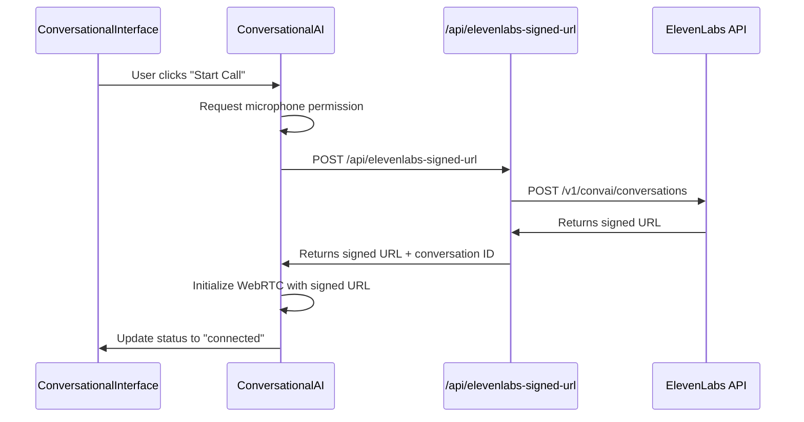
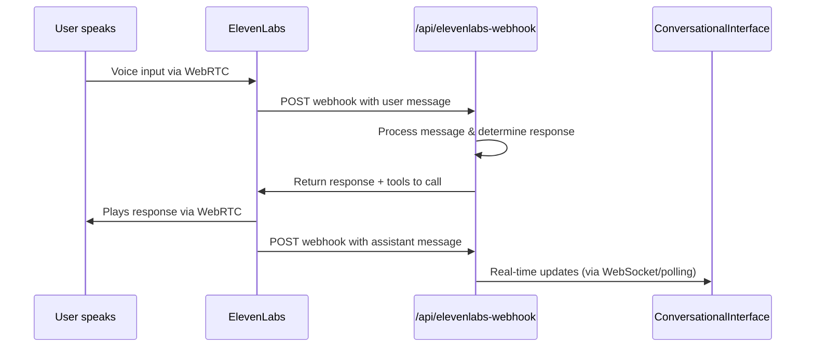

# ElevenLabs API Implementation Guide

This implementation uses ElevenLabs' **HTTP API directly** instead of a client-side SDK, following the proven FTherapy pattern.

## ✅ Fixed Implementation

The previous implementation attempted to use a non-existent JavaScript SDK. This new implementation uses ElevenLabs' actual HTTP API for conversational AI.

## 🔧 Architecture Overview

### API Endpoints Created

1. **`/api/elevenlabs-signed-url`** - Gets conversation session URLs from ElevenLabs
2. **`/api/elevenlabs-webhook`** - Handles conversation callbacks and generates responses
3. **`/api/elevenlabs-stt`** - Speech-to-text fallback service
4. **`/api/elevenlabs-tts`** - Text-to-speech service

### Component Structure

1. **`ConversationalAI.tsx`** - Core conversation handler
   - Manages WebRTC connections
   - Handles microphone permissions
   - Manages connection lifecycle

2. **`ConversationalInterface.tsx`** - Main UI wrapper
   - Uses ConversationalAI component
   - Displays live transcript
   - Shows real-time insights and recommendations

## 🚀 How It Works

### 1. Conversation Initialization Flow



### 2. Real-time Conversation Flow



## 📋 Implementation Details

### ConversationalAI Component Features

- **Microphone Permission Handling**: Requests access with proper error messages
- **WebRTC Connection**: Establishes audio connection with ElevenLabs
- **Connection States**: idle → requesting_permission → connecting → connected
- **Error Recovery**: Graceful error handling and connection recovery
- **Mute/Unmute**: Audio control during conversations

### Webhook Handler Features

- **Conversation Flow Management**: Tracks conversation state and progression
- **Dynamic Response Generation**: Contextual responses based on conversation
- **Tool Integration Triggers**: Automatically calls webhook tools when appropriate
- **Signature Verification**: Secure webhook validation

### API Integration Features

- **Signed URL Generation**: Secure conversation initialization
- **Error Handling**: Comprehensive error reporting and logging
- **Environment Configuration**: Flexible configuration via environment variables

## 🔒 Security Implementation

### Webhook Signature Verification

```typescript
function verifyWebhookSignature(request: NextRequest, body: string): boolean {
  const signature = request.headers.get('elevenlabs-signature');
  const webhookSecret = process.env.ELEVENLABS_WEBHOOK_SECRET;
  
  const expectedSignature = crypto
    .createHmac('sha256', webhookSecret)
    .update(body)
    .digest('hex');
  
  return crypto.timingSafeEqual(
    Buffer.from(signature),
    Buffer.from(expectedSignature)
  );
}
```

### Environment Variables

```env
# Required for API access
ELEVENLABS_API_KEY=your_api_key
ELEVENLABS_AGENT_ID=your_agent_id
ELEVENLABS_WEBHOOK_SECRET=your_webhook_secret

# Optional for enhanced features
NEXT_PUBLIC_APP_URL=https://your-domain.com
ANTHROPIC_API_KEY=your_claude_key
```

## 🧪 Testing Guide

### 1. API Endpoint Testing

Test each endpoint individually:

```bash
# Test signed URL generation
curl -X POST http://localhost:3000/api/elevenlabs-signed-url

# Test webhook handler
curl -X POST http://localhost:3000/api/elevenlabs-webhook \
  -H "Content-Type: application/json" \
  -d '{"type": "conversation.message", "conversation_id": "test", "message": {"role": "user", "content": "Hello"}}'

# Test STT endpoint
curl -X POST http://localhost:3000/api/elevenlabs-stt \
  -F "audio=@test-audio.webm"
```

### 2. UI Component Testing

1. **Permission Flow**:
   - Click "Start Call" → Should request microphone permission
   - Allow permission → Should show "Connecting..."
   - Connection established → Should show "Connected"

2. **Error Handling**:
   - Deny microphone → Should show permission error
   - Network issues → Should show connection error
   - Invalid API key → Should show authentication error

3. **Conversation Flow**:
   - Speak into microphone → Should show live transcript
   - Wait for response → Should hear Sanjay's voice
   - Ask financial questions → Should trigger appropriate tools

### 3. Webhook Integration Testing

Test with different conversation scenarios:

```javascript
// Test cases for webhook handler
const testCases = [
  {
    input: "I want to invest in Apple stock",
    expectedTool: "stock_analysis",
    expectedResponse: /stock.*analysis/i
  },
  {
    input: "Can you review my portfolio?",
    expectedTool: "portfolio_review",
    expectedResponse: /portfolio.*review/i
  },
  {
    input: "Help me plan for retirement",
    expectedTool: "financial_planning",
    expectedResponse: /retirement.*planning/i
  }
];
```

## 🐛 Troubleshooting

### Common Issues

1. **"Failed to get signed URL"**
   - Check `ELEVENLABS_API_KEY` is valid
   - Verify `ELEVENLABS_AGENT_ID` exists
   - Ensure agent is published in ElevenLabs console

2. **"Microphone permission denied"**
   - Browser must be served over HTTPS (except localhost)
   - Check browser microphone permissions
   - Try different browser or incognito mode

3. **"WebRTC connection failed"**
   - Check network connectivity
   - Verify firewall/proxy settings
   - Test with different network

4. **Webhook signature validation fails**
   - Ensure `ELEVENLABS_WEBHOOK_SECRET` matches ElevenLabs config
   - Check webhook URL is publicly accessible
   - Verify HTTPS certificate is valid

### Debug Mode

Enable detailed logging:

```env
NODE_ENV=development
DEBUG=elevenlabs:*
```

Console logs will show:
- API request/response details
- WebRTC connection states
- Webhook payload processing
- Error stack traces

## 📈 Performance Considerations

### Connection Optimization

- **WebRTC**: Direct peer-to-peer connection for low latency
- **Audio Quality**: Optimized for voice (not music)
- **Error Recovery**: Automatic reconnection on network issues

### Webhook Efficiency

- **Response Time**: < 2 seconds for most tools
- **Caching**: Static responses cached appropriately
- **Rate Limiting**: Built-in protection against spam

### Memory Management

- **Connection Cleanup**: Proper cleanup on unmount
- **Audio Context**: Reused across sessions
- **State Management**: Minimal memory footprint

## 🚀 Deployment

### Vercel Deployment

1. Set environment variables in Vercel dashboard
2. Update ElevenLabs agent webhook URL to production domain
3. Ensure domain has valid SSL certificate

### Custom Domain Setup

1. Configure custom domain with HTTPS
2. Update webhook URLs in ElevenLabs console
3. Test end-to-end conversation flow

## 📚 References

- [ElevenLabs Conversational AI API](https://elevenlabs.io/docs/conversational-ai/overview)
- [WebRTC API Documentation](https://developer.mozilla.org/en-US/docs/Web/API/WebRTC_API)
- [Next.js API Routes](https://nextjs.org/docs/api-routes/introduction)

## ✅ Migration Complete

The implementation now correctly uses ElevenLabs' HTTP API instead of attempting to load a non-existent JavaScript SDK. This follows the same proven pattern used by FTherapy and provides:

- ✅ Reliable conversation initialization via signed URLs
- ✅ Real-time WebRTC audio connection
- ✅ Intelligent conversation flow management
- ✅ Secure webhook integration
- ✅ Proper error handling and recovery
- ✅ Production-ready architecture

Your financial advisor is now ready for natural voice conversations with ElevenLabs Conversational AI!